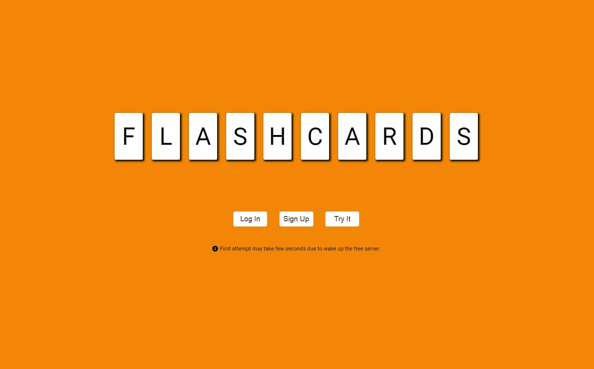
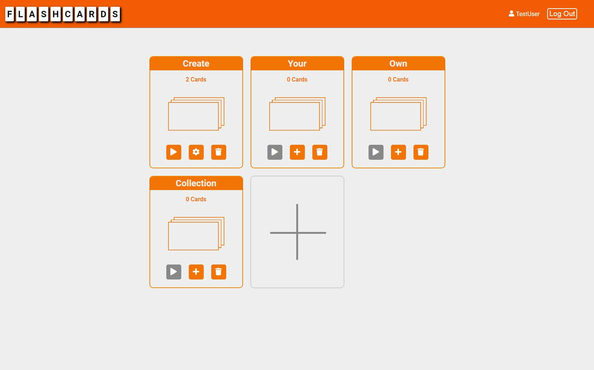
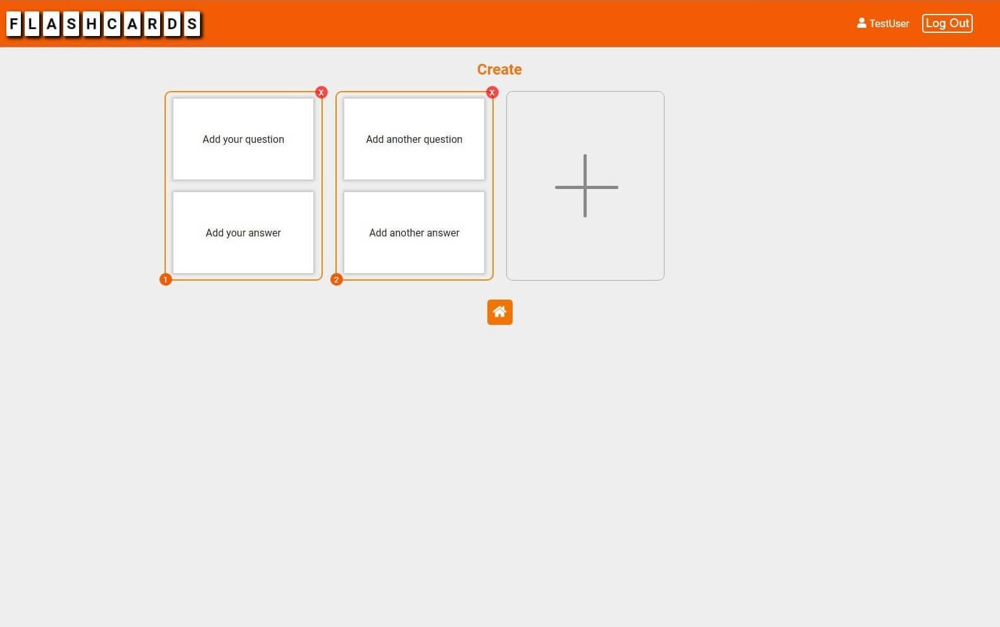
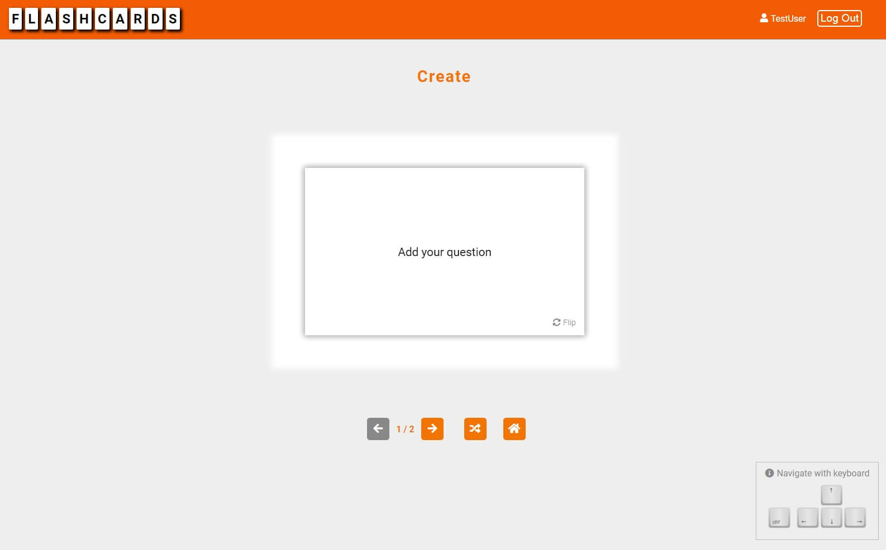

# Flashcards application v2

Register account and create your own collections of flashcards/memory cards to learn with fun. Your collections save in database. Manage your collections. Check your cards, add new or delete them. When you are ready you can start practice. Change cards with three buttons: previous, next or random card. Flip card to check your answer and have fun!

In practice mode you can navigate with keyboard:
arrow up/arrow down - flip card,
arrow left - previous card,
arrow right - next card,
ctrl - random card.

## Live

https://flashcards-app-v2.netlify.app/

## Web-server code

https://github.com/BartlomiejMogielnicki/flashcards-app-api

## Technologies

### Client-side

- React 16.13.1
- Redux 4.0.5
- Styled components 5.1.1
- Netlify

### Web-server

- NodeJS 12.18.1
- Express 4.17.1
- MongoDB 3.6.2
- Mongoose 5.10.8
- Jsonwebtoken 8.5.1
- Bcrypt 2.4.3
- Heroku
- MongoDB Atlas

## Features

- Create an account or try it as a guest
- Create your own collection of flashcards/memory cards
- Data stored in mongodb with hashed user password
- Practice with your own cards
- Use keyboard to flip and change cards
- Responsive design

## Screenshots

### Welcome Page

### Collections Page

### Editor Page

### Practice Page

